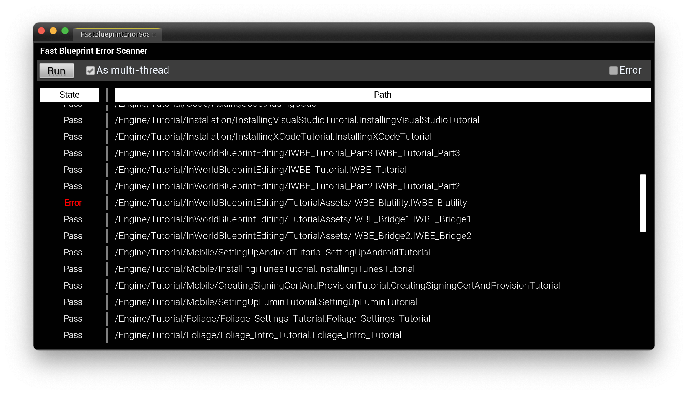
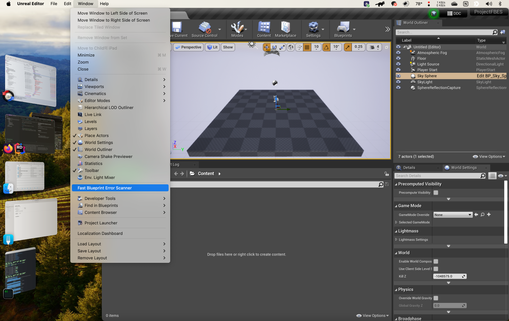

# Fast Blueprint Error Scanner for Unreal Engine 4

This plugin is a simple tool to help you find errors in your blueprints. It will scan all blueprints in your project and list all errors found in them.



## Installation

1. Clone this repository to your project's `Plugins` directory.
2. Enable the plugin in your project's `.uproject` file.

```
{
...
	"Plugins": [
		{
			"Name": "FastBlueprintErrorScanner",
			"Enabled": true
		}
	]
}
```

## Usage

1. Click the `Fast Blueprint Error Scanner` button from 'Window' menu.
2. Click the `Run` button to start scanning all blueprints in your project.


